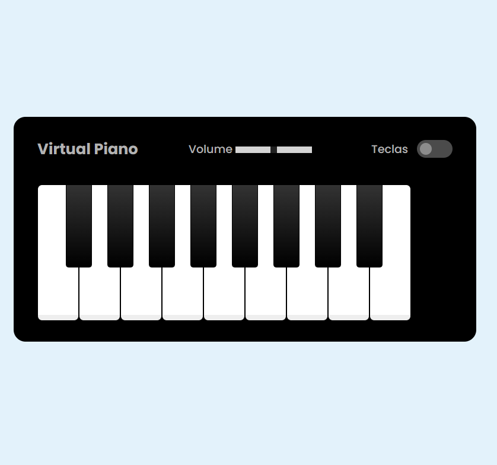
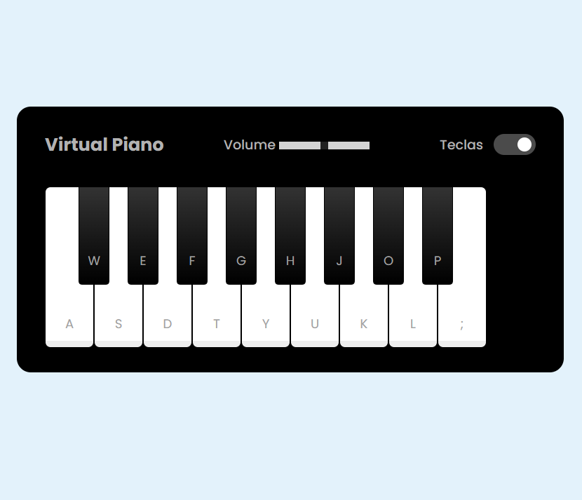

# piano_virtual

Projeto feito com HTML CSS e Javascript para fixar oque foi ensinado no curso da DIO. O foco desse curso foi aprender:
- Adicionar e remover classes dinamicamente pelo Javascript
- Fazer toggle para controle de volume e aparecimento e desaparecimento de teclas
- Pseudo Elementos
- addEventListener
- Adicionando eventos de keydown
  

  

  

  

  ### Link do Piano Virtual:
  https://felipeonmarques.github.io/piano_virtual/
